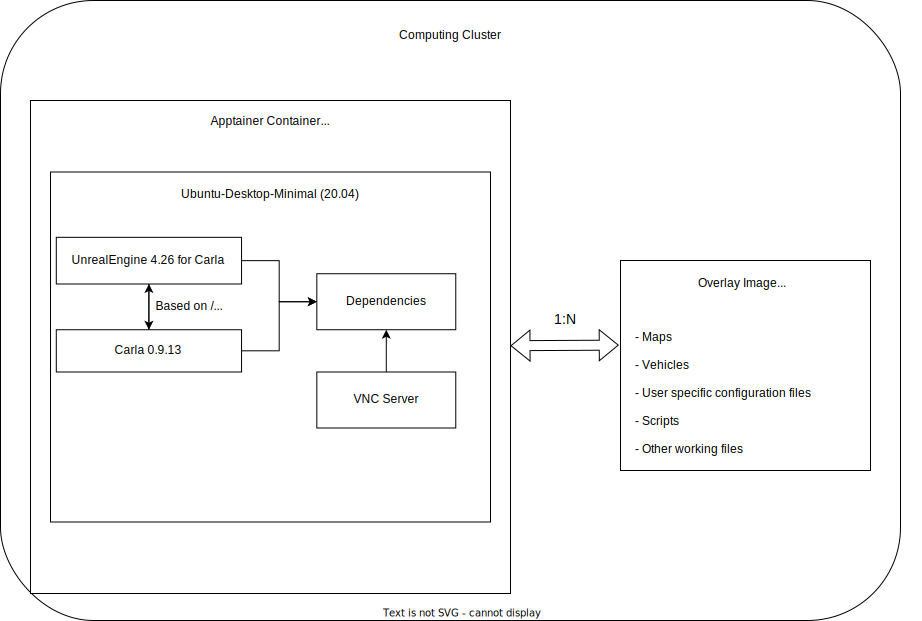

Welcome to the Carla-Based Driverless UMD Simulation Framework
=============================================================

Welcome to the documenation of the Carla-Based Driverless UMD Simulation Framework!
This documenation includes a brief overview about the simulation and its architecture and explains how you can work with the simulation or set it up from scratch.

## Quick Start - Find what you need

This file explains the overall architecture of Carla itself and the container enviorment it has been deployed in.  
*It is highly recommended to keep **reading this file first** in order to obtain a brief overview about the project and its structure*

Depending on your situation and desired workflow you want to read the...

**[User Documentation](User.md)** - If you have an enviorment set up and want to start working.  
**[Admin Documentation](Admin.md)** - If you want to set up the simulation enviorment from scratch locally or need to make changes to the container

# About this Framework

## Purpose of the Project
The framework was built during a student project at the faculty for computer science at the OVGU Magdeburg. The goal of this project was to build a foundation on which the autonoumous behavior of the UMD Racing Car can be simulated and improved to achieve better results in future Driverless disciplines of the Formula Students Germany competitions. 

## Current state of the Project
The project currently consists of the following content:
- **Simulation Framework** - This includes Carla, UnrealEngine and all dependencies related to them in order to create a proper simulation.
- **Maps** - 5 sample maps for the different disciplines the car will face in the Formula Students Competition, according to their rulebook.
- **Car Model** - A (non parameterized) model of the UMD's 2022/2023 racing car. 
- **Dummy Script** - A script which demonstrates how to control a vehicle in CARLA using python.  

As of now the project does not include any "real" simulation content. This is to be done in the future. 

## Used technologies in the framework

### Quick Overview
- **[CARLA Simlulator](https://github.com/carla-simulator/carla)** - Base of our Framework
- **[UnrealEngine (4.26)](https://www.unrealengine.com/en-US)** - Foundation of the Carla Simulator
- **[Apptainer](https://apptainer.org/)** - Container Enviorment to run the Framework remotely on a computing cluster
- **[Ubuntu 20.04](https://releases.ubuntu.com/focal/)** - Required operation system for carla.
- **VNCServer (Insert Link)** - VNC Protocol running in Container to allow working remotely.

This simulation-framework is build on the open-source [CARLA Simlulatior](https://github.com/carla-simulator/carla) which allows to build a broad variety of simulations using plain python scripts or ros nodes (*to learn more about using ros in this framework, please have a look at the admin documentation)*.  
CARLA itself is build using a fork of [UnrealEngine](https://www.unrealengine.com/en-US) (Version 4.26) with modifications to the engine, cutting of some unneeded features and making it overall more suitable for its usecase.  
Carla is running inside a container using [Apptainer](https://apptainer.org/) which is based on [Ubuntu 20.04](https://releases.ubuntu.com/focal/). The container can be executed on the cluster of the OVGU and accessed via a VNC connection.

### Carla: Packaged vs Unpackaged Version
If you have read the documenation of Carla you might have noted that there are two different "versions" of the projects. A tiny **packaged** version which allows the user to start writing scripts within minutes and an **unpackaged** version which has drastictly higher system requirements and takes longer to install.   

The difference is that using the unpackaged version you can make major changes to the carla simulation using the forked UnrealEngine editor, which is not available in the packaged version. This allows you to modify/add maps or vehicles. Some of these features are planned to be supported in the packaged version in the future, but are not as of CARLA Version 0.9.12.  
In this framework **only the unpackaged version of Carla** is used, which allows major changes to maps and the used vehicles as explained above.

## Running Carla & Container enviorment
Using the unpackaged version of the CARLA simulator a lot more computing ressources are necessary, compared to the packaged version. To build and run Carla you should fulfill the following requirements for a good user experience:
- **Ubuntu 18.04 or newer**  
- **130gb disk space (200gb+ for building the simulation)** 
- **Minimum of 6-8gb GPU Vram** - The following GPUs (or higher) are suitable 1080Ti, 2070+, 3060+, 40XX  
- **(Recommended) High amount of CPU Cores** - Especially when building the project for the first time, however also in some production workflows a high amount of CPU cores is beneficial to speed up loading times.  

Due to these hardware requirements we decided to bundle the simulation in an [Apptainer](https://apptainer.org/) Container which can be run on the Computing Cluster of the OVGU and accessed from outside via a VNC Connection

