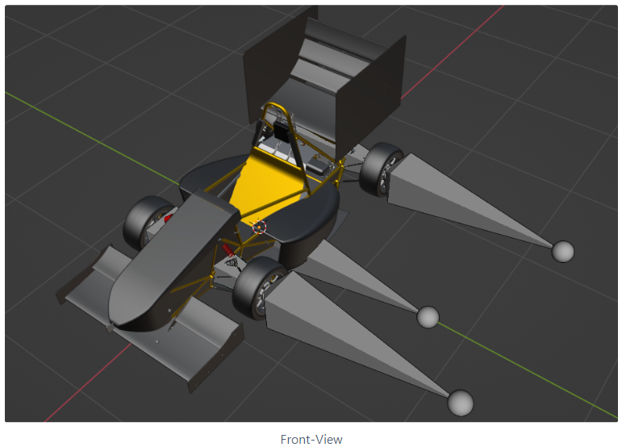
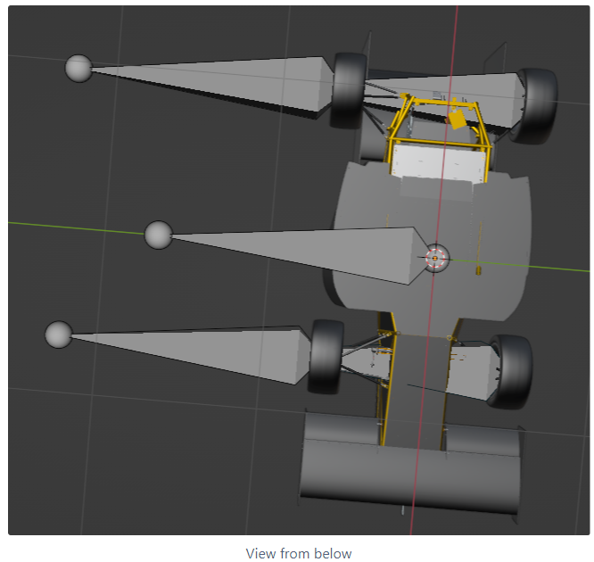
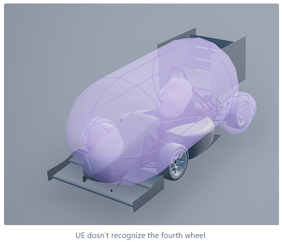

Welcome to the 
Documentation
=================================
# Before you continue
This documentation is **correct** for you if you have access to Carla already (either locally or on the Cluster of the OVGU) and want to do the following things:
- **Start Working** - Start the Container upon getting access to the Cluster. 
- **Write Scripts** - Creating an actual simulation using python scripts.
- **Manage Maps** - Import, Create, Delete or Change maps.
- **Manage vehicles** - Import, Create, Delete or Change Vehicles.

If this is not the case, please refer to the [Mainpage](README.md) or the [Admin Documentation](Admin.md)

# Start Working
## Quickstart
1. **Install a VNC-Client** - Install a VNC Client of your choice. Popular Client are (INSERT VNC CLIENTS (WITH TESTED))
2. **Install a VPN** - In order to access the cluster you may have to use a VPN (DONT KNOW IF THIS IS THE CASE). Please refer to [OVGU - VPN ACCESS](https://www.urz.ovgu.de/vpn-path-204,616.html) for more information. After installation, start the client. 
3. **Connect via SSH** - After activating the VPN connect to the Cluster using ssh. You can do this using the following command (TODO: COMMAND UPDATE): ```ssh <username>@ants.cs.ovgu.de``` <br/>*Upon entering the command you will be asked for a password. The password is your URZ password (the same you use for moodle or the lsf)* <br/>
4. **Start a Container** - Upon being connected via SSH use ```cd path/to/workdir ``` to open the working directory (INSERT OVERLAY CREATE STEP?). Following that you can start the container by typing ```apptainer run --nv --overlay <overlay> <container_name>``` <br/> If everything went accordingly you should see that your bash user is now "Apptainer"<br/>
5. **Open a VNC Connection** - On your own system, open your VNCClient and enter the following command: ```<vnc connnect command to be inserted>```
6. **Login** - If the connection was successful you should see an Gnome Login screen. Enter your URZ Credentials to continue.
7. **Start Carla** - Navigate to the working directory in the container using ```cd path/to/working_dir_in_container``` and start carla using ```make launch``` <br/> Note: This process might take a while (on the first launch approximately 20 minutes). If you did everything correctly you should now see an UnrealEngine V4 Editor.
8. **Deploy** - Now its time to start the simulation. Choose a map in the file browser or use the current selected one. In the top-right corner of the UrealEngine editor hit "deploy". This process should take a few minutes, depending on the system you are on. Upon completion you should see a new window on your screen. You can move arond with you W-A-S-D keys and your mouse. You have now started your first Carla Server. 

## Troubleshooting
This is ToDo - Maybe also just expand the Quickstart Section and make it more detailed.

# Manage Maps


## Create new Maps

To add a new map in Carla (or Unreal Engine), we use the [Roadrunner](https://de.mathworks.com/products/roadrunner.html) software from MathWorks. <br/>
You need a license for this software. The OVGU has a MathLab license, but Roadrunner is not included in this license. <br/>
To get this license, you have to contact [URZ](https://www.urz.ovgu.de/MATLAB.html).) <br/>

Tips for installing Roadrunner:
[here](https://de.mathworks.com/help/roadrunner/ug/install-and-activate-roadrunner.html?s_tid=srchtit)

Now that you have a license, install Roadrunner as described above (link). Remember that your computer must be logged in!


Quick links: 
- [Tutorials](https://de.mathworks.com/videos/search.html?q=&fq[]=product:RD&page=1)
- [Roadrunner Documentation](https://de.mathworks.com/help/roadrunner/index.html)

Once you have successfully installed Roadrunner, create a new project by creating a new Scene.


 

### Most important tools in Roadrunner:


With this tool you can easily drag roads by right-clicking, the design of the road can be selected at the bottom right (Library Browser/RoadStyles) (Hint: first select the design and then drag the roads).


With these two tools you can customize the width of the road. Also, once you have customized a road design to your own liking, you can save it and reuse it at a later time.


With this tool you can connect two roads.


This allows you to specify a surface (off the road). The default is lawn, but this can be easily changed by drag and drop (just drag a material (Library Browser) into the specified area.


With this tool you can add single object. Select an object (Library Browser/Props/...) and position it by right-clicking.


This tool is very handy when you need to add several objects with the same distance. As with the tool above, select the object to be added. On the right side an attribute window will open where you can specify the distance between the objects.


### Adding objects that do not yet exist

If you want to add object which is not included in the Library Browser of Roadrunner, you can simply add the .fbx file to the file path (/path/to/project/(Assets).

Sometimes there can be problems with the alignment of the added object. Either you rotate your object again and add it to the Library Browser again or you rotate the object manually in Roadrunner.

### Export map from Roadrunner

File => Export => CARLA (.fbx / .xodr / .rrdata.xml)

Unfortunately, the position of the track is not so easy to read from the export. If you need this, I recommend the export with Apollo (.xml / .bin), because there in the XML file the positions of the left and right side, as well as the position of the center of the track is easy to read (I would write a small Python script to get the coordinates, then goes faster than to write them out).

### Import into Carla

To import your map into the carla simulation please refer to the official guide from the [Carla Documentation](https://carla.readthedocs.io/en/0.9.7/how_to_make_a_new_map/) (Section 3 onwards). 

--- 
## Modify Maps:
To Modify the layout of the map, import the map into Roadrunner and follow the steps from the [Create Maps Section](createMap.md) <br/>
To add Props to an existing maps please refer to the [CARLA Documentation](https://carla.readthedocs.io/en/latest/tuto_A_add_props/)

---


# Manage Vehicles


## Create a new Vehicle
To add a car model in CARLA, you need the model itself and a suitable physics model. Note that the physics model should be very very simple, so that the calculations are not so difficult/expensive.

The car model should also not be unnecessarily complicated, as this is only necessary for the optics, i.e. not every switch or cable flow needs to be modeled now.

If you need to "clean up" a model, i.e. make it less complicated, you can also do this with Blender (Merge Objects in Blender, Key: j). Keep in mind that the wheels must still be single objects, so they can't be joined, but the rest of the car can be an object.

So the following must be present: A model where the single wheels are still objects and the rest of the car is an object, i.e. you have a model which consists of five objects.


In order for CARLA to work with the model, each car model still needs bones. The structure of the required bones can be found here (Add a 4 wheeled vehicle)

In the bone model, the bones hang together, these must first be detached from each other and later hang together again in the same hierarchy. These bones must be on the wheels, as well as on the chassis.





When adding the bones it is important that the hierarchy of the bones is not changed (see picture above)!

When you have finished this model, export it again as an .fbx file.

This node auto model must now be uploaded to Unreal Engine to create a physical asset mesh ([Helpful video](https://www.youtube.com/watch?v=TItjnI4A0io&t=381s)).

To do this, press Add/Import => import to game => select file => Import in the Content Browser (see import details [here]( https://carla.readthedocs.io/en/latest/tuto_A_add_vehicle/). Now you will find a file named Vehicle_Name_ PhysicsAssets in the Content Browser. If you click on it, it will open and you will see a physics model.



If UE does not recognize a wheel, click Options in the left Skeleton Tree window and select Show All Bones:


When you have done this, you will see all the wheels and the Vehicle Base. If a wheel is missing, select it (in my case the left front wheel) and click on Add Bodies in the lower right corner. Now the left front wheel should also be displayed.

Since the wheels are not round, I change this on the right side in the Tools/Body Creation window. There I select Sphere instead of Capsule. I can also do this with the Vehicle Base, but there not with Sphere but with Multi Convex Hull, so the physics model is even closer to the actual model.


# Write Scripts
1. Open a new terminal in your VNC Session and navigate to the folder where carla is located using ```cd /home/carla/carla```
2. Navigate to the PythonAPI/Examples using ```cd /PythonAPI/Examples```
3. Copy the dummyscript to have something to start with using ```cp ./dummy_script.py <desired_path/script_name>.py```
4. Navigate to the directory you copied your script to and open it using ```code <script_name>```
5. Write some code
6. Deploy a map using the "Deploy" button in the top-right corner of the UnrealEngine editor (See [Quick Start 8.]() for more information). Once the server is started execute your script using ```python3 <script_name>```. 
