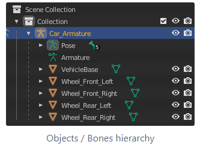
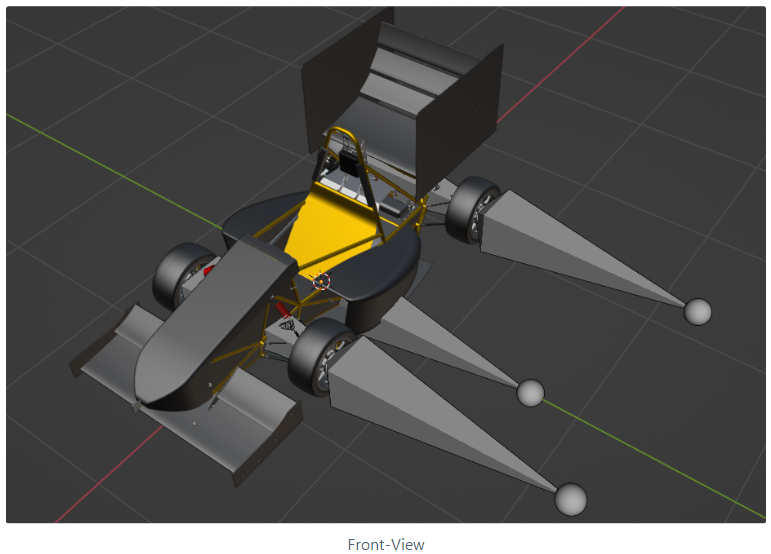
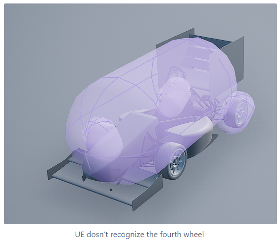

# Car model 

---

To add a car model in CARLA, you need the model itself and a suitable physics model. Note that the physics model should be very very simple, so that the calculations are not so difficult/expensive.

The car model should also not be unnecessarily complicated, as this is only necessary for the optics, i.e. not every switch or cable flow needs to be modeled now.

If you need to "clean up" a model, i.e. make it less complicated, you can also do this with Blender (Merge Objects in Blender, Key: j). Keep in mind that the wheels must still be single objects, so they can't be joined, but the rest of the car can be an object.

So the following must be present: A model where the single wheels are still objects and the rest of the car is an object, i.e. you have a model which consists of five objects.

In order for CARLA to work with the model, each car model still needs bones. The structure of the required bones can be found [here]( https://carla.readthedocs.io/en/latest/tuto_A_add_vehicle/) (Add a 4 wheeled vehicle)

In the bone model, the bones hang together, these must first be detached from each other and later hang together again in the same hierarchy. These bones must be on the wheels, as well as on the chassis.

When adding the bones it is important that the hierarchy of the bones is not changed (see picture above)!

When you have finished this model, export it again as an .fbx file.

This node auto model must now be uploaded to Unreal Engine to create a physical asset mesh ([Helpful video](https://www.youtube.com/watch?v=TItjnI4A0io&t=381s)).

To do this, press Add/Import => import to game => select file => Import in the Content Browser (see import details [here]( https://carla.readthedocs.io/en/latest/tuto_A_add_vehicle/). Now you will find a file named Vehicle_Name_ PhysicsAssets in the Content Browser. If you click on it, it will open and you will see a physics model.

If UE does not recognize a wheel, click Options in the left Skeleton Tree window and select Show All Bones:
