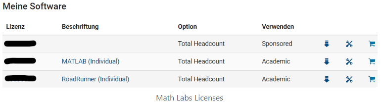
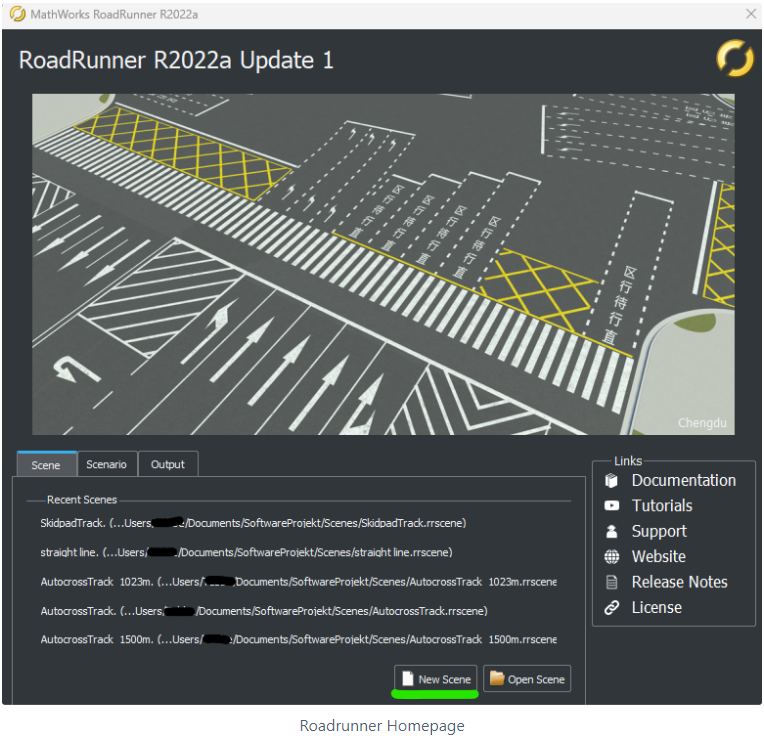
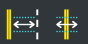

# Create new map 

To add a new map in Carla (or Unreal Engine), we use the [Roadrunner](https://de.mathworks.com/products/roadrunner.html) software from MathWorks.

You need a license for this software. The OVGU has a MathLab license, but Roadrunner is not included in this license.

To get this license, you have to contact [URZ](https://www.urz.ovgu.de/MATLAB.html).)

Tips for installing Roadrunner:
[here](https://de.mathworks.com/help/roadrunner/ug/install-and-activate-roadrunner.html?s_tid=srchtit)

Now that you have a license, install Roadrunner as described above (link). Remember that your computer must be logged in!

Quick links: 
- [Tutorials](https://de.mathworks.com/videos/search.html?q=&fq[]=product:RD&page=1)
- [Roadrunner Documentation](https://de.mathworks.com/help/roadrunner/index.html)

Once you have successfully installed Roadrunner, create a new project by creating a new Scene.

---

## Most important tools in Roadrunner:

With this tool you can easily drag roads by right-clicking, the design of the road can be selected at the bottom right (Library Browser/RoadStyles) (Hint: first select the design and then drag the roads).

With these two tools you can customize the width of the road. Also, once you have customized a road design to your own liking, you can save it and reuse it at a later time.

With this tool you can connect two roads.

This allows you to specify a surface (off the road). The default is lawn, but this can be easily changed by drag and drop (just drag a material (Library Browser) into the specified area.

With this tool you can add single object. Select an object (Library Browser/Props/...) and position it by right-clicking.

This tool is very handy when you need to add several objects with the same distance. As with the tool above, select the object to be added. On the right side an attribute window will open where you can specify the distance between the objects.

---

## Adding objects that do not yet exist

If you want to add object which is not included in the Library Browser of Roadrunner, you can simply add the .fbx file to the file path (C:UsersUSERSPEICHERORT_DES_PROJEKTESAssets).

Sometimes there can be problems with the alignment of the added object. Either you rotate your object again and add it to the Library Browser again or you rotate the object manually in Roadrunner.

---

## Export map from Roadrunner

File => Export => CARLA (.fbx / .xodr / .rrdata.xml)

Unfortunately, the position of the track is not so easy to read from the export. If you need this, I recommend the export with Apollo (.xml / .bin), because there in the XML file the positions of the left and right side, as well as the position of the center of the track is easy to read (I would write a small Python script to get the coordinates, then goes faster than to write them out).
